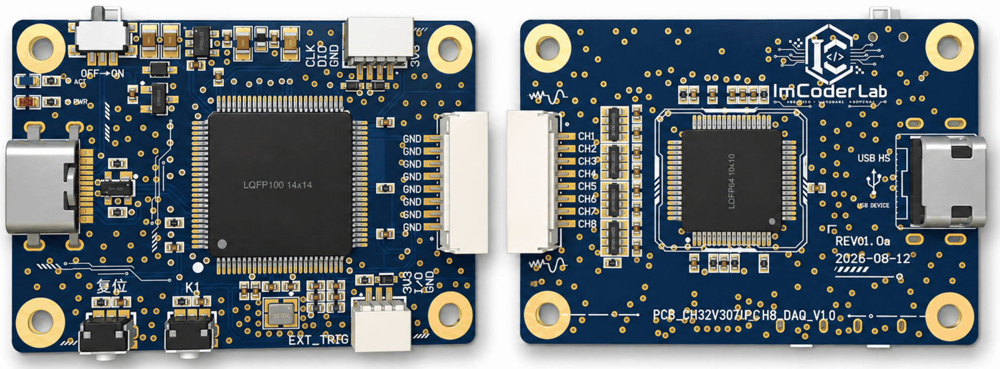
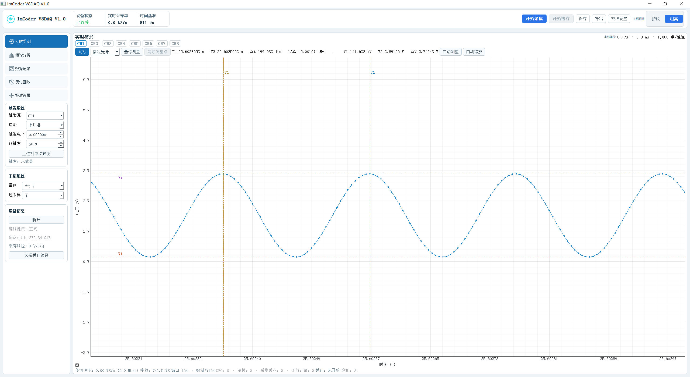

# CH32V307V_CH8_DAQ_V1.0

8 CH ｜ 16 bit ｜ 200 kSPS/CH ｜ 同步采样 ｜ USB 2.0

# 1. 产品概述

> CH32V307V_CH8_DAQ_V1.0 是一款基于 CH32V307V 的 8 通道同步数据采集卡，支持 16-bit ADC、最高 200 kSPS/CH 同步采样，并通过 USB2.0 将采样数据实时传输至 PC。配套 Python 上位机支持实时波形显示、数据存储及后续信号分析。

# 2. 核心特点

- **8 CH 同步采样**  
  8 路模拟输入同步采集，适用于多通道信号分析。

- **16-bit 高分辨率 ADC**  
  提供更精细的电压信号采集能力。

- **200 kSPS / CH 高速采样**  
  最高支持 200 kSPS 实时采集。

- **±10 V / ±5 V 双量程输入**  
  兼容多种模拟电压信号。

- **USB2.0 实时传输**  
  采样数据可实时上传至 PC。

- **Python 上位机支持**  
  支持实时波形、数据存储及二次分析。

# 3. 详细规格

| 参数          | 规格                 |
| ------------- | ------------------- |
| 模拟输入      | 8 CH                 |
| ADC分辨率     | 16 bit               |
| 最高采样率    | **200 kSPS / CH**    |
| 总采样率      | 200kSPS             |
| 采样方式      | **8通道同步采样**    |
| 输入范围      | ±10 V / ±5 V        |
| 输入类型      | 单端/双极性          |
| 模拟带宽      | 20kHz               |
| 输入阻抗      | 1MΩ                 |
| SNR           | 90 dB typ.（±10 V、无过采样）               |
| ENOB          | 约 14.7 bit               |
| RMS Noise     | 约 224 µV RMS（按±10 V满量程、SNR=90 dB估算）|
| 通信方式      | USB2.0               |
| 工作模式      | 连续                 |    
| 上位机 SDK    | Python               |
| 尺寸          | 46 × 32 mm             |

# 4. 硬件接口

# 5. 使用教程

本设备用于同步采集 8 路模拟信号，并通过 USB 将波形实时显示、分析和保存到 Windows 电脑。

## 1. 首次使用

1. 将整个 `PC/release/ImCoder V8DAQ V1.0` 文件夹复制到电脑，不要只复制 EXE 文件。
2. 连接采集设备。首次连接时，使用 Zadig 将采集设备的**接口 0**驱动改为 `WinUSB`。
3. 不要修改 WCH-LinkRV 等调试下载器的驱动。
4. 双击 `ImCoder V8DAQ V1.0.exe` 启动上位机。

## 2. 开始采集

1. 确认顶部设备状态显示“已连接”；若未连接，可点击左侧“连接”。
2. 在左侧“采集配置”中选择量程：`±5 V` 或 `±10 V`。
3. 选择过采样倍率：无、2×、4×、8×、16×、32×或64×。过采样倍率越高，采样率越低。
4. 点击顶部“开始采集”，即可查看 8 路实时波形；再次点击可停止采集。

> 采集或记录过程中不要切换量程、过采样倍率或执行设备校准。

## 3. 波形查看

- 鼠标滚轮可缩放坐标轴，左键拖动可移动波形。
- “自动缩放”可恢复合适的显示范围。
- “光标”可测量时间差、频率和电压差。
- 开启“悬停测量”后，将鼠标移到波形附近可查看采样点数值。
- 停止采集后，可用左键锁定多个测量点。
- 顶部“保存”可将当前波形或频谱保存为 PNG 图片。

## 4. 频谱分析

点击左侧“频谱分析”，选择分析通道、窗函数和 FFT 点数，即可查看主频、THD、THD+N、SNR、SINAD 和 SFDR 等结果。

## 5. 数据记录与回放

1. 默认保存目录为 `文档\VDAQ-Records`，可点击顶部“导出”修改目录。
2. 在“数据记录”页选择记录模式、格式和通道。
3. 点击顶部“开始缓存”开始记录，完成后点击“停止记录”。
4. 推荐使用 `.vdaq` 格式进行高速或长时间记录；CSV 文件较大，适合短时间记录或导入其他软件。
5. 在“历史回放”页选择记录文件，可缩放、翻页、拖动时间轴并查看各通道数据；也可在记录列表中双击文件直接回放。

异常中止的记录会保留为 `.partial` 临时文件，它不是完整记录文件。

## 6. 通道设置与校准

在“校准设置”页可以修改通道名称、显示状态、单位、工程增益和工程零偏。

设备电压校准需要精密直流源和高精度万用表，必须先停止采集和记录。`±5 V` 与 `±10 V` 量程需分别校准；不熟悉校准流程时，请勿写入设备校准参数。

## 7. 常见问题

- **设备未连接**：检查 USB 线、电源及接口 0 是否已正确绑定 WinUSB。
- **没有波形**：确认已点击“开始采集”，输入接线正确，信号没有超出所选量程。
- **出现饱和提示**：输入接近满量程，请降低信号幅值或切换到 `±10 V` 量程。
- **记录文件过大**：优先使用 VDAQ 格式，或提高过采样倍率以降低采样率。
- **设备意外断开**：上位机会尝试自动重连；若仍失败，请重新插拔 USB 后点击“连接”。

关闭软件前，请先停止数据记录和采集。