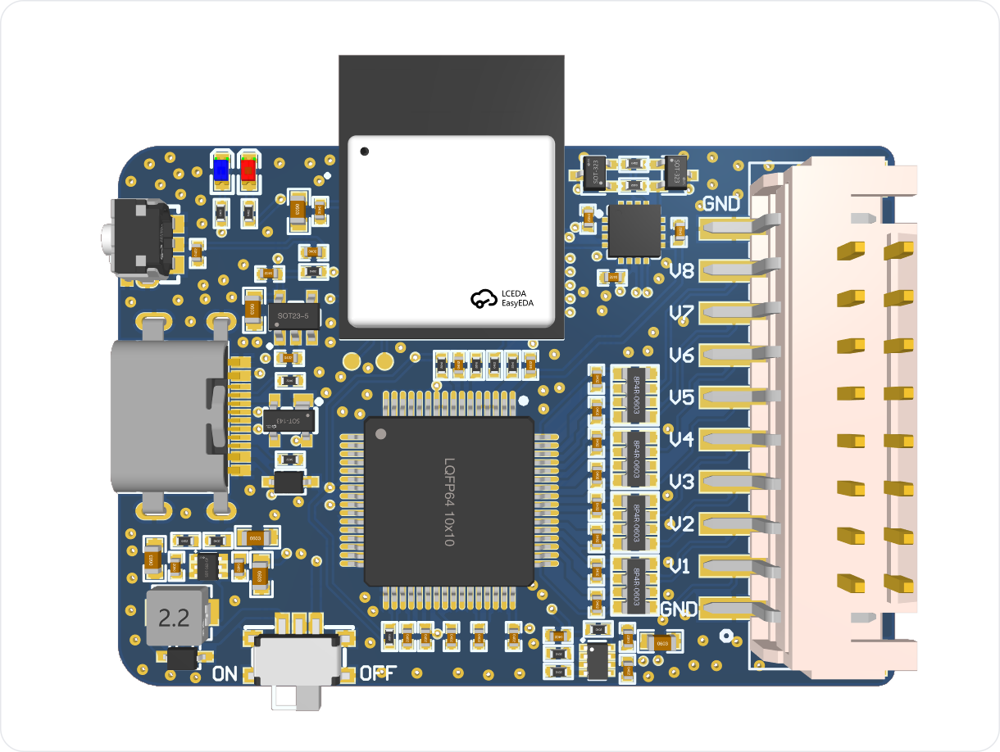

# ESP32C6_CH8_DAQ_V1.0

8 CH ｜ 16 bit ｜ 200 kSPS/CH ｜ 同步采样 ｜ Wi-Fi TCP

# 1. 产品概述

> ESP32C6_CH8_DAQ_V1.0 是一款基于 ESP32-C6 的 8 通道同步数据采集卡，支持 16-bit ADC、最高 200 kSPS/CH 同步采样，并通过 Wi-Fi TCP 将采样数据实时传输至 PC。配套 Python 上位机支持实时波形显示、数据存储及后续信号分析。

# 2. 核心特点

- **8 CH 同步采样**  
  8 路模拟输入同步采集，适用于多通道信号分析。

- **16-bit 高分辨率 ADC**  
  提供更精细的电压信号采集能力。

- **200 kSPS / CH 高速采样**  
  单通道最高支持 200 kSPS 实时采集。

- **±10 V / ±5 V 双量程输入**  
  兼容多种模拟电压信号。

- **Wi-Fi TCP 实时传输**  
  采样数据可无线实时上传至 PC。

- **Python 上位机支持**  
  支持实时波形、数据存储及二次分析。

# 3. 详细规格

| 参数          | 规格                 |
| ------------- | ------------------- |
| 模拟输入      | 8 CH                 |
| ADC分辨率     | 16 bit               |
| 最高采样率    | **200 kSPS / CH**     |
| 总采样率      | 约为 1500kSPS        |
| 采样方式      | **8通道同步采样**    |
| 输入范围      | ±10 V / ±5 V        |
| 输入类型      | 单端/双极性          |
| 模拟带宽      | 实测后填写           |
| 输入阻抗      | 实测/设计值          |
| SNR       | 实测后填写               |
| ENOB      | 实测后填写               |
| RMS Noise | 实测后填写               |
| 通信方式      | WiFi TCP             |
| 工作模式      | 连续                 |    
| 上位机 SDK    | Python               |
| 尺寸        | 46 × 32 mm             |

# 4. 硬件接口

# 5. 使用教程